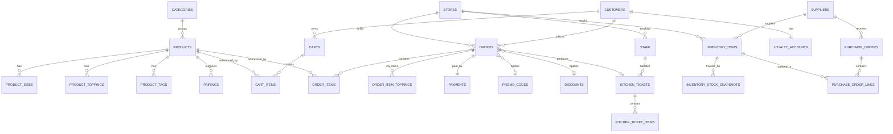

# Database Design — Aura Coffee Roasters

This document reverse-engineers the data model implied by the current codebase (today backed by hardcoded arrays in `src/lib/data.ts` and a handful of `localStorage`-backed stores: `catalog.ts`, `cart.ts`, `order.ts`, `inventory-store.ts`) and proposes a normalized relational schema that a real backend (Postgres/MySQL) would use to replace them.

## 1. Scope & source mapping

| Domain area | Current implementation | Becomes |
|---|---|---|
| Menu catalog | `src/lib/data.ts` (`products`, `categories`, `pairings`) + `src/lib/catalog.ts` (admin-added items in `localStorage`) | `categories`, `products`, `product_sizes`, `product_toppings`, `product_tags`, `pairings` |
| Shopping cart | `src/lib/cart.ts` (`localStorage`) | `carts`, `cart_items` |
| Placed orders | `src/lib/order.ts` (`localStorage`, single last order) + `src/components/shop/checkout-view.tsx` (tips/promos/discounts/payment options) | `orders`, `order_items`, `payments`, `promo_codes`, `discounts` |
| Kitchen display | `src/components/admin/kds-board.tsx` (in-memory `initial` ticket array) | `kitchen_tickets`, `kitchen_ticket_items` (derived from `orders`/`order_items`) |
| Inventory & stock | `src/components/admin/inventory-ledger.tsx` (`items` array) + `src/lib/inventory-store.ts` (admin-added materials in `localStorage`) | `suppliers`, `inventory_items`, `inventory_stock_snapshots` |
| Purchasing | `src/components/admin/inventory-ledger.tsx` (`po` array) + `src/components/admin/create-po-sheet.tsx` | `purchase_orders`, `purchase_order_lines` |
| Customers & loyalty | `src/lib/data.ts` (`customer` object) | `customers`, `loyalty_accounts` |
| Stores | `src/lib/data.ts` (`locations`) | `stores` |
| Staff | Names referenced in KDS/inventory copy (e.g. "Mateo Silva", "Elena Vasquez") | `staff` |

## 2. Entity-relationship diagram

## 3. Table definitions

### 3.1 Catalog

#### `categories`
| Column | Type | Constraints | Notes |
|---|---|---|---|
| id | varchar(20) | PK | e.g. `coffee`, `tea`, `food`, `desserts` (matches `CategoryId`) |
| label | varchar(100) | NOT NULL | English display label |
| label_km | varchar(100) | NULL | Khmer display label |
| eyebrow | varchar(150) | NULL | Small overline shown on menu page |
| title | varchar(150) | NULL | Section heading |
| title_km | varchar(150) | NULL | |
| note | varchar(200) | NULL | e.g. "Served until 3:00 PM daily" |
| note_km | varchar(200) | NULL | |
| sort_order | smallint | NOT NULL DEFAULT 0 | Controls tab ordering |

#### `products`
| Column | Type | Constraints | Notes |
|---|---|---|---|
| id | uuid | PK | Surrogate key (today a `slug` string plays this role) |
| slug | varchar(150) | UNIQUE NOT NULL | URL segment, e.g. `honey-cinnamon-oat-latte`. Replaces the buggy ASCII-only `slugify()` — generate from a UUID or transliteration table instead of stripping Khmer text |
| category_id | varchar(20) | FK → `categories.id` NOT NULL | |
| name | varchar(150) | NOT NULL | |
| name_km | varchar(150) | NULL | |
| kicker | varchar(150) | NULL | Subtitle, e.g. "House Signature" |
| kicker_km | varchar(150) | NULL | |
| description | text | NULL | |
| description_km | text | NULL | |
| base_price | numeric(10,2) | NOT NULL | Used when `product_sizes` has no rows |
| image_url | varchar(300) | NOT NULL | |
| image_tag | varchar(80) | NULL | Small badge over the photo, e.g. "Barista Pick" |
| badge | varchar(40) | NULL | Temperature badge: `ក្ដៅ` / `ត្រជាក់` / `ក្ដៅ/ត្រជាក់` |
| extra | varchar(40) | NULL | e.g. "6 oz", "2,100m" |
| customizable | boolean | NOT NULL DEFAULT false | Shows the size/temperature/milk/topping configurator |
| is_custom | boolean | NOT NULL DEFAULT false | true for admin-created items (today's `CustomProduct`) |
| is_live | boolean | NOT NULL DEFAULT true | Visible on the customer menu vs. withdrawn |
| created_by_staff_id | uuid | FK → `staff.id` NULL | Set when `is_custom = true` |
| created_at | timestamptz | NOT NULL DEFAULT now() | |
| updated_at | timestamptz | NOT NULL DEFAULT now() | |

> Today, built-in products (`src/lib/data.ts`) and admin-created products (`CustomProduct` in `catalog.ts`) are two different sources merged in memory by `useAllProducts()`. In a real DB they're one `products` table distinguished by `is_custom`.

#### `product_sizes`
Replaces the fixed `[number, number, number]` tuple (`sizePrices`) with real rows so a product can have any number of sizes.
| Column | Type | Constraints | Notes |
|---|---|---|---|
| id | uuid | PK | |
| product_id | uuid | FK → `products.id` NOT NULL | |
| size_label | varchar(20) | NOT NULL | `តូច` / `ធម្មតា` / `ធំ` |
| sort_order | smallint | NOT NULL | 0 = small, 1 = regular, 2 = large |
| price | numeric(10,2) | NOT NULL | |

#### `product_toppings`
Replaces the inline `toppings[]` array on `Product` (today also duplicated as the standalone `defaultToppings` constant used by every drink that doesn't define its own).
| Column | Type | Constraints | Notes |
|---|---|---|---|
| id | uuid | PK | |
| product_id | uuid | FK → `products.id` NULL | NULL rows are the global/default toppings available to every customizable drink |
| label | varchar(80) | NOT NULL | |
| label_km | varchar(80) | NULL | |
| price_delta | numeric(10,2) | NOT NULL DEFAULT 0 | |
| is_locked | boolean | NOT NULL DEFAULT false | Pre-selected and non-removable (e.g. cinnamon) |

#### `product_tags`
| Column | Type | Constraints | Notes |
|---|---|---|---|
| id | uuid | PK | |
| product_id | uuid | FK → `products.id` NOT NULL | |
| label | varchar(60) | NOT NULL | e.g. "Vegan", "Signature" |
| label_km | varchar(60) | NULL | |
| tone | varchar(10) | NOT NULL | `forest` \| `amber` \| `neutral` |

#### `pairings`
Suggested add-on items shown on the product detail page (today a flat list in `data.ts`, not linked to specific products).
| Column | Type | Constraints | Notes |
|---|---|---|---|
| id | uuid | PK | |
| slug | varchar(150) | UNIQUE NOT NULL | |
| name | varchar(150) | NOT NULL | |
| name_km | varchar(150) | NULL | |
| description | text | NULL | |
| description_km | text | NULL | |
| price | numeric(10,2) | NOT NULL | |
| image_url | varchar(300) | NOT NULL | |
| cta_label | varchar(60) | NULL | e.g. "Add Pairing" |
| cta_label_km | varchar(60) | NULL | |

---

### 3.2 Customers & loyalty

#### `customers`
| Column | Type | Constraints | Notes |
|---|---|---|---|
| id | uuid | PK | |
| name | varchar(150) | NOT NULL | |
| phone | varchar(30) | UNIQUE NULL | |
| email | varchar(200) | UNIQUE NULL | |
| avatar_url | varchar(300) | NULL | |
| created_at | timestamptz | NOT NULL DEFAULT now() | |

#### `loyalty_accounts`
| Column | Type | Constraints | Notes |
|---|---|---|---|
| customer_id | uuid | PK, FK → `customers.id` | 1:1 with customer |
| tier | varchar(40) | NOT NULL DEFAULT 'Member' | e.g. "Gold Member" |
| stars | int | NOT NULL DEFAULT 0 | |
| stars_goal | int | NOT NULL DEFAULT 200 | Stars needed for next reward |
| updated_at | timestamptz | NOT NULL DEFAULT now() | |

---

### 3.3 Cart & checkout

#### `carts`
| Column | Type | Constraints | Notes |
|---|---|---|---|
| id | uuid | PK | |
| customer_id | uuid | FK → `customers.id` NULL | NULL for guest carts |
| created_at | timestamptz | NOT NULL DEFAULT now() | |
| updated_at | timestamptz | NOT NULL DEFAULT now() | |

#### `cart_items`
Mirrors `CartLine` in `src/lib/cart.ts`.
| Column | Type | Constraints | Notes |
|---|---|---|---|
| id | uuid | PK | |
| cart_id | uuid | FK → `carts.id` NOT NULL | |
| product_id | uuid | FK → `products.id` NOT NULL | |
| variant_key | varchar(200) | NOT NULL | Today's composite id, e.g. `regular-hot-oat-honey` — distinguishes identical products configured differently |
| unit_price | numeric(10,2) | NOT NULL | Snapshot of price at add-time |
| qty | int | NOT NULL CHECK (qty > 0) | |
| details_label | varchar(300) | NULL | Human-readable summary, e.g. "Regular 12 oz · Hot · Oat Milk · Extra Honey Drizzle" |
| tag | varchar(60) | NULL | e.g. "Signature" |

#### `promo_codes`
| Column | Type | Constraints | Notes |
|---|---|---|---|
| code | varchar(40) | PK | e.g. `WELCOME5` |
| label | varchar(60) | NOT NULL | |
| amount | numeric(10,2) | NOT NULL | Flat discount amount |
| active | boolean | NOT NULL DEFAULT true | |

#### `discounts`
Staff/admin-applied discounts at checkout (distinct from customer-entered promo codes).
| Column | Type | Constraints | Notes |
|---|---|---|---|
| id | uuid | PK | |
| label | varchar(60) | NOT NULL | e.g. "បញ្ចុះតម្លៃ $5.00" |
| amount | numeric(10,2) | NOT NULL | |

#### `payments`
| Column | Type | Constraints | Notes |
|---|---|---|---|
| id | uuid | PK | |
| order_id | uuid | FK → `orders.id` UNIQUE NOT NULL | 1:1 with order |
| method | varchar(20) | NOT NULL | `aba` \| `cash` |
| method_label | varchar(80) | NOT NULL | Snapshot, e.g. "ABA ឬស្កេន QR" |
| amount | numeric(10,2) | NOT NULL | |
| paid_at | timestamptz | NULL | |

#### `orders`
Mirrors `PlacedOrder` in `src/lib/order.ts`, extended with fulfillment fields from `checkout-view.tsx`.
| Column | Type | Constraints | Notes |
|---|---|---|---|
| id | uuid | PK | Today a string like `ACR-8942` — keep as a human-friendly `order_code` column too |
| order_code | varchar(20) | UNIQUE NOT NULL | Display code, e.g. `ACR-8942` |
| customer_id | uuid | FK → `customers.id` NULL | |
| store_id | uuid | FK → `stores.id` NOT NULL | |
| fulfillment_method | varchar(20) | NOT NULL | `store` \| `curbside` (per `checkout-view.tsx` `method` state) |
| fulfillment_timing | varchar(20) | NOT NULL DEFAULT 'asap' | `asap` \| `later` |
| scheduled_for | timestamptz | NULL | Set when `fulfillment_timing = 'later'` |
| subtotal | numeric(10,2) | NOT NULL | |
| tax | numeric(10,2) | NOT NULL DEFAULT 0 | |
| tip | numeric(10,2) | NOT NULL DEFAULT 0 | |
| discount_id | uuid | FK → `discounts.id` NULL | |
| discount_amount | numeric(10,2) | NOT NULL DEFAULT 0 | Snapshot, survives discount edits |
| promo_code | varchar(40) | FK → `promo_codes.code` NULL | |
| promo_discount_amount | numeric(10,2) | NOT NULL DEFAULT 0 | |
| total | numeric(10,2) | NOT NULL | |
| status | varchar(20) | NOT NULL DEFAULT 'new' | `new` \| `brewing` \| `ready` \| `completed` \| `cancelled` |
| placed_at | timestamptz | NOT NULL DEFAULT now() | |

#### `order_items`
| Column | Type | Constraints | Notes |
|---|---|---|---|
| id | uuid | PK | |
| order_id | uuid | FK → `orders.id` NOT NULL | |
| product_id | uuid | FK → `products.id` NOT NULL | |
| qty | int | NOT NULL CHECK (qty > 0) | |
| unit_price | numeric(10,2) | NOT NULL | Snapshot at order time |
| details_label | varchar(300) | NULL | |
| station | varchar(20) | NULL | Kitchen routing, e.g. `Bar A`, `Hearth` (mirrors `Ticket.items[].station` in `kds-board.tsx`) |

#### `order_item_notes`
Freeform prep notes shown on KDS tickets (today `Ticket.items[].notes: string[]`).
| Column | Type | Constraints | Notes |
|---|---|---|---|
| id | uuid | PK | |
| order_item_id | uuid | FK → `order_items.id` NOT NULL | |
| note | varchar(300) | NOT NULL | |
| sort_order | smallint | NOT NULL DEFAULT 0 | |

---

### 3.4 Kitchen display (KDS)

The board in `kds-board.tsx` is really just a filtered/derived view over open orders, routed to stations — modeled here as its own ticket table so a ticket's prep-specific state (elapsed timer, SLA, flags) doesn't pollute the order record itself.

#### `kitchen_tickets`
| Column | Type | Constraints | Notes |
|---|---|---|---|
| id | uuid | PK | |
| order_id | uuid | FK → `orders.id` UNIQUE NOT NULL | |
| status | varchar(20) | NOT NULL | `new` \| `brewing` \| `ready` \| `scheduled` |
| channel_label | varchar(80) | NULL | e.g. "អាទិភាពរហ័ស", "ចំណតទទួលក្រៅរថយន្ត #3" |
| sla_minutes | int | NOT NULL DEFAULT 10 | Target prep time |
| started_at | timestamptz | NOT NULL DEFAULT now() | Used to compute `elapsed` |
| ready_at | timestamptz | NULL | |
| flag_tone | varchar(10) | NULL | `amber` \| `neutral` |
| flag_text | varchar(300) | NULL | e.g. allergy/eco-packaging callouts |
| assigned_staff_id | uuid | FK → `staff.id` NULL | |

#### `kitchen_ticket_items`
Thin join row so one ticket can reference several `order_items`, each marked done independently per station.
| Column | Type | Constraints | Notes |
|---|---|---|---|
| id | uuid | PK | |
| ticket_id | uuid | FK → `kitchen_tickets.id` NOT NULL | |
| order_item_id | uuid | FK → `order_items.id` NOT NULL | |
| station | varchar(20) | NOT NULL | `Bar A` \| `Bar B` \| `Hearth` \| `Bakery` \| `Cold Lab` \| `Tea Bar` |
| done | boolean | NOT NULL DEFAULT false | |

---

### 3.5 Inventory & purchasing

#### `suppliers`
Normalizes the free-text `supplier` / `supplierNote` fields in `inventory-ledger.tsx`.
| Column | Type | Constraints | Notes |
|---|---|---|---|
| id | uuid | PK | |
| name | varchar(150) | UNIQUE NOT NULL | e.g. "Finca La Esperanza" |
| note | varchar(200) | NULL | e.g. "ជួញដូរផ្ទាល់ បានចុះហត្ថលេខា" |
| relationship_type | varchar(20) | NOT NULL | `direct_trade` \| `distributor` |

#### `inventory_items`
| Column | Type | Constraints | Notes |
|---|---|---|---|
| id | uuid | PK | |
| store_id | uuid | FK → `stores.id` NOT NULL | |
| supplier_id | uuid | FK → `suppliers.id` NULL | NULL for admin quick-added materials with no assigned supplier yet (`src/lib/inventory-store.ts`) |
| name | varchar(150) | NOT NULL | |
| meta | varchar(250) | NULL | e.g. "Huila · Anaerobic Washed · Lot #248" |
| group_name | varchar(40) | NOT NULL | `Single Origin Beans` \| `Milk & Dairy` \| `Syrups & Botanicals` \| `Bakery` \| `Packaging` |
| unit_label | varchar(20) | NOT NULL DEFAULT 'kg' | |
| par_level | numeric(10,2) | NOT NULL | Target stock level |
| image_url | varchar(300) | NULL | |
| is_custom | boolean | NOT NULL DEFAULT false | true for materials added via the "+ បន្ថែមសម្ភារះ" quick-add flow |
| created_at | timestamptz | NOT NULL DEFAULT now() | |

#### `inventory_stock_snapshots`
Point-in-time stock readings (today a single `onHand`/`pct`/`state` per item with no history).
| Column | Type | Constraints | Notes |
|---|---|---|---|
| id | uuid | PK | |
| inventory_item_id | uuid | FK → `inventory_items.id` NOT NULL | |
| on_hand_qty | numeric(10,2) | NOT NULL | |
| pct_of_par | smallint | NOT NULL | Derived, but cached for fast dashboard reads |
| state | varchar(20) | NOT NULL | `low` \| `critical` \| `healthy` \| `fresh` \| `adequate` |
| recorded_at | timestamptz | NOT NULL DEFAULT now() | |

#### `purchase_orders`
| Column | Type | Constraints | Notes |
|---|---|---|---|
| id | uuid | PK | |
| po_code | varchar(20) | UNIQUE NOT NULL | e.g. `PO-2025-084` |
| store_id | uuid | FK → `stores.id` NOT NULL | |
| status | varchar(20) | NOT NULL DEFAULT 'draft' | `draft` \| `approved` \| `sent` |
| funding_account | varchar(100) | NULL | e.g. "Flagship Roastery Operating Fund (#***849)" |
| created_by_staff_id | uuid | FK → `staff.id` NULL | |
| created_at | timestamptz | NOT NULL DEFAULT now() | |
| approved_at | timestamptz | NULL | |

#### `purchase_order_lines`
Mirrors `PoLine` in `src/components/admin/create-po-sheet.tsx`.
| Column | Type | Constraints | Notes |
|---|---|---|---|
| id | uuid | PK | |
| purchase_order_id | uuid | FK → `purchase_orders.id` NOT NULL | |
| inventory_item_id | uuid | FK → `inventory_items.id` NULL | NULL allowed so a line can reference a brand-new material not yet formalized as an `inventory_items` row |
| description | varchar(200) | NOT NULL | e.g. "Minor Figures Barista Oat (12cs)" |
| supplier_id | uuid | FK → `suppliers.id` NULL | |
| qty | int | NOT NULL DEFAULT 1 | |
| price | numeric(10,2) | NOT NULL | |

---

### 3.6 Stores & staff

#### `stores`
| Column | Type | Constraints | Notes |
|---|---|---|---|
| id | uuid | PK | |
| name | varchar(150) | NOT NULL | e.g. "Downtown Flagship" |
| address | varchar(250) | NOT NULL | |
| hours_label | varchar(100) | NULL | e.g. "Mon – Sun • 6:30 AM – 7:00 PM" |

#### `staff`
| Column | Type | Constraints | Notes |
|---|---|---|---|
| id | uuid | PK | |
| store_id | uuid | FK → `stores.id` NOT NULL | |
| name | varchar(150) | NOT NULL | e.g. "Mateo Silva" |
| role | varchar(40) | NOT NULL | e.g. `shift_lead`, `barista` |

---

## 4. Key design notes

1. **Slug generation bug carried over from the code.** `src/lib/catalog.ts`'s `slugify()` strips every non-ASCII character, so a Khmer-only product name collapses to `""` (fixed in this session to fall back to the raw name). A real schema should not rely on a derived slug as the identity at all — use a generated `uuid` primary key (`products.id`) and keep `slug` as a unique, independently-assigned display column.
2. **Built-in vs. admin-created products are one table, not two.** The app currently merges `src/lib/data.ts`'s static `products` array with `localStorage`-backed `CustomProduct` rows at render time via `useAllProducts()`. In the schema this collapses to a single `products` table with an `is_custom` flag — no reason to keep them physically separate once there's a real database.
3. **Sizes and toppings become rows, not fixed-shape JSON.** `sizePrices: [number, number, number]` and inline `toppings[]` are convenient in a mock but don't scale (always exactly 3 sizes, toppings duplicated per product). `product_sizes` and `product_toppings` normalize this; `product_toppings.product_id IS NULL` represents today's shared `defaultToppings` fallback.
4. **Orders snapshot price and labels.** `order_items.unit_price` and `details_label` intentionally duplicate data from `products`/`product_sizes` at order time, so a later price change or product edit never rewrites history — this mirrors what `cart.ts`/`order.ts` already do today (storing `unitPrice` and a freeform `details` string per line).
5. **KDS tickets are a view-layer concern over orders**, not a separate source of truth — `kitchen_tickets` / `kitchen_ticket_items` exist mainly to hold prep-specific, mutable state (timers, station routing, done-flags per item) that has no business living on the immutable `orders` record.
6. **Purchase order lines tolerate unresolved inventory items.** The new "Create Purchase Order" popup (`create-po-sheet.tsx`) lets staff type a brand-new material name on the fly, before it's ever been formalized as a tracked `inventory_items` row — hence `purchase_order_lines.inventory_item_id` is nullable and `description` carries the raw text regardless.
